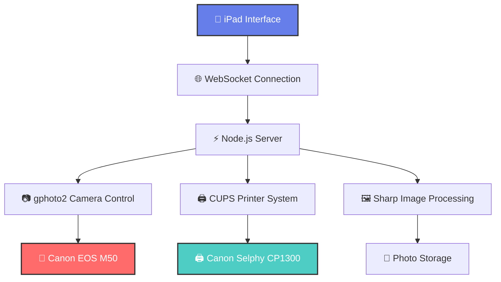

<div align="center">

# 📸 Photobooth Pro

*A sophisticated multi-device photobooth application*

[](LICENSE)
[](https://nodejs.org)
[](https://www.apple.com/macos)

**Transform any space into a professional photo studio with live preview, instant capture, and automatic printing.**


</div>

---

## 🌟 Features

<table>
<tr>
<td width="50%">

### 🎥 **Live Camera Preview**
- Real-time video streaming from Canon EOS M50
- 720×480 optimized preview at 12 FPS
- Zero-delay frame capture technology
- Smart camera state persistence

### 📱 **Touch-Optimized Interface**  
- iPad-native responsive design
- Elegant animations and transitions
- Modern glassmorphism UI elements
- Intuitive gesture controls

</td>
<td width="50%">

### 🖼️ **Professional Quality**
- 3000×2000 pixel captures (6 MP)
- 3:2 aspect ratio for perfect prints
- 95% JPEG quality with progressive encoding
- Sharp image processing pipeline

### 🖨️ **Instant Printing**
- Canon Selphy CP1300 integration
- Automatic print queue management
- Photo review before printing
- Print/retake workflow

</td>
</tr>
</table>

## 🏗️ System Architecture



## ⚡ Quick Start

### Prerequisites

<details>
<summary><b>📋 System Requirements</b></summary>

- **macOS** 10.15+ (Catalina or later)
- **Node.js** 18.0+ with npm
- **gphoto2** (installed via Homebrew)
- **Canon EOS M50** camera
- **Canon Selphy CP1300** printer

</details>

### 🚀 Installation

```bash
# Clone the repository
git clone https://github.com/KuroTsubasa1/photobooth.git
cd photobooth

# Install dependencies
npm install

# Configure environment
cp .env.example .env

# Run setup script
chmod +x setup.sh && ./setup.sh

# Start the application
./start.sh
```

### 🌐 Access Points

| Device | URL | Purpose |
|--------|-----|---------|
| 💻 Local | `http://localhost:3000` | Development & testing |
| 📱 iPad | `http://[YOUR_IP]:3000` | Touch interface |

## 🎛️ Configuration

### Camera Settings

| Parameter | Value | Description |
|-----------|-------|-------------|
| **Capture Resolution** | 3000×2000 | High-quality 6MP photos |
| **Preview Resolution** | 720×480 | Optimized streaming |
| **Aspect Ratio** | 3:2 | Professional photo format |
| **Frame Rate** | 12 FPS | Smooth live preview |
| **JPEG Quality** | 95% | Near-lossless compression |

### Network Configuration

Edit `.env` file:
```bash
PORT=3000
SERVER_IP=192.168.1.100  # Your MacBook IP
PRINTER_NAME=Canon_SELPHY_CP1300
```

## 🎯 Usage Guide

### 📋 Step-by-Step Operation

1. **🔌 Hardware Setup**
   - Connect Canon EOS M50 via USB
   - Power on Canon Selphy CP1300 printer
   - Ensure all devices are on same WiFi network

2. **🚀 Start Session**
   - Run `./start.sh` on MacBook
   - Open iPad browser to your server URL
   - Tap "Connect to Camera" to begin

3. **📸 Photo Workflow**
   - Live preview appears automatically
   - Tap "Take Photo" when ready
   - Review image in full-screen modal
   - Choose "Print Photo" or "Retake"

4. **🖨️ Printing**
   - Photos automatically queued for printing
   - Monitor print status via notifications
   - Collect physical prints from Selphy

## 🏛️ Project Structure

```
photobooth/
├── 📁 client/                 # Frontend application
│   ├── 📄 index.html         # Main HTML interface
│   ├── 🎨 styles.css         # Responsive CSS styling
│   └── ⚡ app.js             # Client-side JavaScript
├── 📁 server/                 # Backend application
│   ├── 📄 index.js           # Express server & Socket.IO
│   └── 📁 controllers/       # Business logic modules
│       ├── 📷 videoStreamManager.js    # Camera streaming
│       ├── 📸 cameraController.js      # Camera operations
│       └── 🖨️ printerController.js     # Print management
├── 🔧 package.json          # Dependencies & scripts
├── 🚀 start.sh              # Startup script
└── 📖 README.md             # This documentation
```

## 🛠️ Advanced Configuration

### Custom Camera Settings

```javascript
// server/controllers/videoStreamManager.js
const cameraSettings = {
  resolution: '3000x2000',
  quality: 95,
  aspectRatio: '3:2',
  frameRate: 12
};
```

### Print Customization

```javascript
// server/controllers/printerController.js
const printOptions = {
  media: 'Postcard',
  quality: 'high',
  fitToPage: true
};
```

## 🔧 Troubleshooting

<details>
<summary><b>📷 Camera Issues</b></summary>

**Camera not detected:**
```bash
# Kill interfering processes
sudo killall PTPCamera

# Check camera connection
gphoto2 --auto-detect

# Verify USB mode
# Set camera to PC connection mode
```

**Stream errors:**
- Ensure camera is not in use by other applications
- Try different USB ports
- Restart the camera

</details>

<details>
<summary><b>🖨️ Printer Issues</b></summary>

**Printer not found:**
```bash
# Check CUPS status
lpstat -p

# Add printer if needed
lpadmin -p Canon_SELPHY_CP1300 -E -v usb://...
```

**Print failures:**
- Verify printer has paper loaded
- Check ink/ribbon levels
- Ensure printer is set as default
</details>

<details>
<summary><b>🌐 Network Issues</b></summary>

- Verify all devices on same WiFi network
- Check firewall allows port 3000
- Use `ipconfig getifaddr en0` to find your IP
- Test connectivity with `ping [SERVER_IP]`
</details>

## 🤝 Contributing

We welcome contributions! Please see our [Contributing Guidelines](CONTRIBUTING.md).

1. **🍴 Fork** the repository
2. **🌿 Create** a feature branch (`git checkout -b feature/amazing-feature`)
3. **💾 Commit** your changes (`git commit -m 'Add amazing feature'`)
4. **📤 Push** to the branch (`git push origin feature/amazing-feature`)
5. **🔄 Open** a Pull Request

## 📄 License

This project is licensed under the **Source Available License** - see the [LICENSE](LICENSE) file for details.

**Summary**: You may view, study, and fork this code for personal and educational purposes. Commercial use requires explicit permission.

## 🙏 Acknowledgments

- **📷 Canon** - For excellent camera hardware
- **🖨️ Canon Selphy** - For instant printing technology  
- **⚡ gphoto2** - For camera control capabilities
- **🎨 Sharp** - For fast image processing
- **🌐 Socket.IO** - For real-time communication
- **🎥 FFMPEG** - For video stream processing
- **🔄 v4l2loopback** - For virtual video device creation
